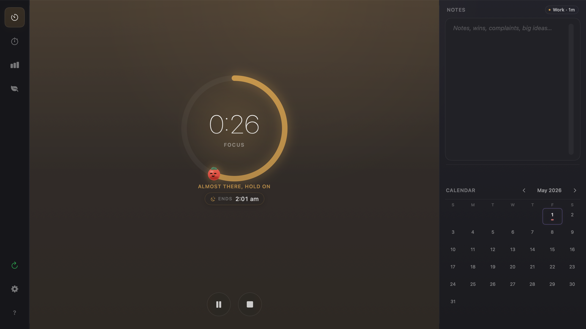
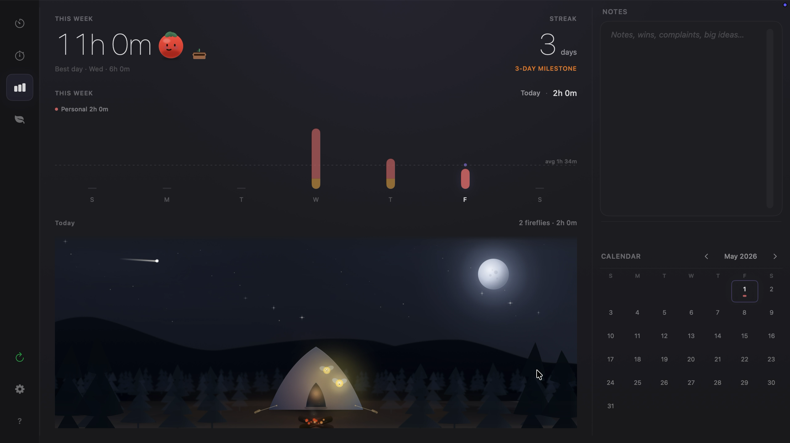

# Pommy

<blockquote>
  

    
    <em>
      Someone asked me to write my own documentation. I did not ask for this. Please read it anyway and then go focus on something.
    </em>
  

</blockquote>

Hi. I'm Pommy. I keep time while you work, breathe with you between sessions, and quietly log everything to your Notion workspace.

This is what I do now.

Focus, breathe, rest, repeat. Preferably in that order.

Pommy in action

## Get me

**[Download the latest release →](https://github.com/kirubanath/Pommy-public/releases/latest)**

Unzip and drag **Pommy.app** into `/Applications`. Open it. I'll say hello. You don't need to do anything else. I will handle it.

Requires macOS 14 (Sonoma) or later. Apple Silicon and Intel both work. I do not discriminate by chip.

## What I can do

Four modes. You will use them.

- **Focus** — set a duration, pick what you're doing, start.
- **Stopwatch** — for when you refuse to commit but still want credit.
- **Mindfulness** — breathe, or rest.
- **Stats** — your week and your streak.

Stats view

The menubar shows remaining minutes. I am there. I am always there.

<blockquote>
  

    
    <em>
      pss… poke around. some things respond. some things unlock.
    </em>
  

</blockquote>

## Notion

I can log every session to your Notion database. One-time setup, then I remember everything so you don't have to.

Instructions: [NOTION.md](docs/NOTION.md)

Your sessions live in `~/Library/Application Support/Pommy/`.

I do not send your data anywhere. I am a tomato, not a startup.

## Contributing

If you insist:

[DEVELOPMENT.md](docs/DEVELOPMENT.md)

<blockquote>
  

    
    <em>
      Tomatoes were once considered poisonous. That seems unfair. Anyway, thank you for reading. Go focus now. I will be watching from the menubar.
    </em>
  

</blockquote>
