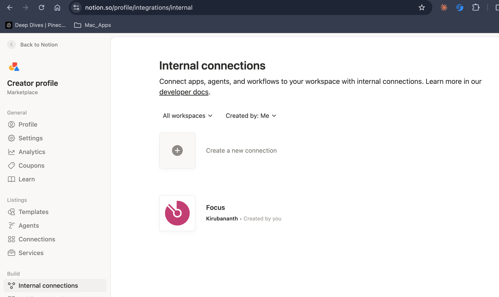
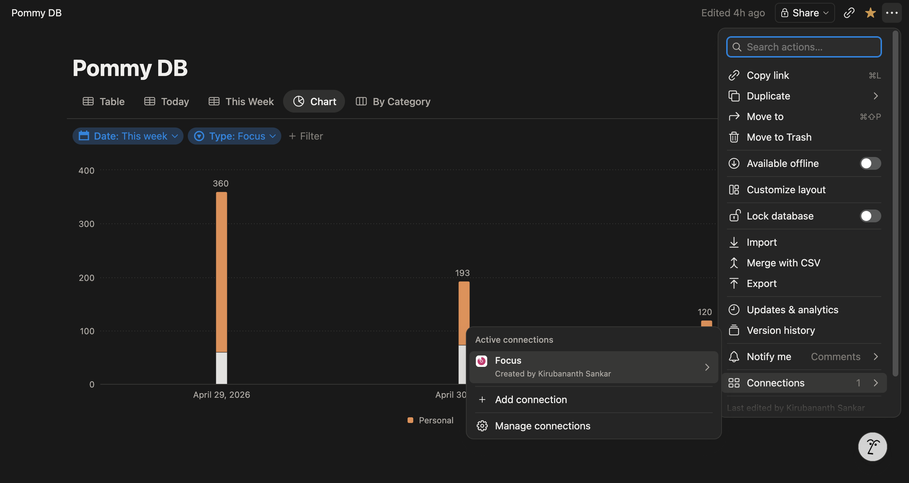

# Connecting Pommy to Notion

I log every focus and break session to a Notion database that lives in *your* workspace, not mine. Set it up once and forget about it.

The whole thing takes about 5 minutes. If you're on a team workspace, you'll need to be a **workspace owner** to create the integration. On a personal workspace, you already are one. Congratulations.

---

## 1. Create the database

In Notion, create a new page, then add a **full-page database**:

- Type `/database` inline and pick **Database - Full page**, or
- Use **+ New page** in the sidebar and choose **Database**.

Add these properties **exactly as named** (case and spelling matter, I am a literal tomato):

| Property name    | Type   | Notes                                              |
|------------------|--------|----------------------------------------------------|
| `Task`           | Title  | Already there by default.                          |
| `Category`       | Select | e.g. `Work`, `Study`, `Personal`. Add a few up front. |
| `Type`           | Select | Add two options: `focus` and `break`.              |
| `Date`           | Date   | The day of the session.                            |
| `Duration (min)` | Number | Planned duration in minutes.                       |
| `Overflow (min)` | Number | Time past the planned end.                         |
| `Device`         | Select | e.g. `MacBook`, `Desktop`. Add at least one.       |
| `Notes`          | Text   | Reflections from the stop sheet.                   |

> **Pre-populate your `Select` options.** Notion rejects unknown select values from integrations, so add `focus` and `break` under `Type` (and at least one option under `Category` and `Device`) before connecting me. Otherwise my first write will fail and I will pout.

If you'd rather rename a column (e.g. `Task name` instead of `Task`), see [Custom column names](#custom-column-names) at the bottom.

---

## 2. Create an integration

The page you want is buried a few clicks deep. Two ways in:

**Fast way — direct link:** [notion.so/profile/integrations/internal](https://www.notion.so/profile/integrations/internal)

**Manual way (in case the link doesn't load):**

1. Click your **profile** (top-left) → **Settings**.
2. Under the **Account** section, open **Connections**.
3. Scroll to the bottom and click **Develop or manage integrations**.

Either path lands you here:

Then:

1. Click **+ New internal integration** (or the equivalent "create new connection" button).
2. Fill in the form:
   - **Connection name** — `Pommy` (or whatever you want to call me).
   - **Icon** — optional. 512×512 if you're feeling fancy.
   - **Installable in** — pick the workspace your database lives in.
3. Click **Create**.
4. You'll land on the integration's page. Open the **Configure** tab.
5. Find **Installation access token** and copy it. It starts with `ntn_…`.

That's it for creating the integration. Hold onto that token, you'll paste it into Pommy in step 4.

> Lost the token later? Go back to [notion.so/profile/integrations/internal](https://www.notion.so/profile/integrations/internal), open your integration, and grab it again from the **Configure** tab.

---

## 3. Give me access to the database

Integrations don't get access by default. You have to invite me, like a vampire.

1. Open your Pommy database in Notion (the full-page one you made in step 1).
2. Click the **•••** menu in the top-right corner of the page.
3. A panel opens with a *lot* of options (move, delete, customize, lock, etc.). Don't panic. Scroll all the way to the bottom.
4. Under **Connections**, click **+ Add connections**.
5. Search for `Pommy` (or whatever you named your integration in step 2). Click it. Confirm.

You'll know it worked when `Pommy` shows up listed under **Connections** on that database.

### While you're here: grab the database link

You'll paste this into Pommy in step 4, so grab it now while the page is open:

- Click **Share** (top-right) → **Copy link**, or
- Just copy the URL from your browser's address bar — both work.

It'll look something like:
`https://www.notion.so/<workspace>/<MyDatabase>-abcdef0123…?v=…`

Don't bother trimming it. I'll fish the database ID out myself.

> Without the connection step above, I can't read or write to the database, and Validate will fail in step 4 with a "could not find database" error.

---

## 4. Paste it into Pommy

Open Pommy → **Settings → Notion** and fill in *two* things:

- **Integration token** — the `ntn_…` Installation access token from step 2.
- **Database link** — paste the full URL you copied in step 3. Just drop it in. I pull the database ID out of the link myself, and reuse the same URL for the *Open Notion* button. One field, two jobs.

That's it. No more counting hex characters at the end of URLs.

Click **Validate connection**. If everything's right, I'll say **Connected** and start logging from your next session.

> If I can't find a database ID in your link, I'll flag it with a ⚠︎ next to the field. That usually means you pasted a workspace URL or a regular page URL instead of the database. Open the database in Notion, copy from the address bar, paste again.

---

## Troubleshooting

If Validate fails, it's almost always one of these:

- **`Unauthorized` / `API token is invalid`** — you copied the token wrong, or pasted something else entirely. Re-copy from [notion.so/profile/integrations/internal](https://www.notion.so/profile/integrations/internal) → your integration → **Configure** tab.
- **⚠︎ next to the Database link field** — your link doesn't contain a 32-character database ID. Open the database in Notion (not a regular page or the workspace home), then re-copy the URL.
- **`Could not find database`** — you skipped step 3. Open the database, **•••** → **Connections** → add `Pommy`.
- **`property does not exist`** — a column is misspelled or has the wrong type. Check the table in step 1 character by character.
- **`Option ... does not exist`** — a `Select` field is missing an option (usually `focus` or `break` under `Type`). Add it manually in Notion.
- **Wrong workspace** — the integration was scoped to a different workspace than your database. Create a new integration in the correct workspace.

Still stuck? Open an issue with the exact error and I'll come look.

---

## Custom column names

Prefer `Task name` over `Task`? Edit `~/Library/Application Support/Pommy/config/notion_schema.json` and change the `notion_name` for any field. I re-read that file on every save, so no restart needed.
